# Desafio SQL - Banco de Dados de Filmes 🎬

[](LICENSE)
[](https://www.microsoft.com/sql-server)
[](https://www.dio.me)

## 📑 Sobre o Projeto

Desafio prático do curso .NET da Digital Innovation One (DIO) focado em consultas SQL. O projeto simula um banco de dados de um site de filmes, onde são armazenados dados sobre filmes, atores e gêneros.

## 🎯 Objetivos

Desenvolver 12 consultas SQL diferentes para extrair informações específicas do banco de dados, demonstrando domínio em:
- Consultas básicas e avançadas
- Relacionamentos entre tabelas
- Ordenação e agrupamento de dados
- Filtros e condições

## 🗃️ Estrutura do Banco de Dados


## 📊 Consultas e Resultados

### 1 - Buscar o nome e ano dos filmes
```sql
SELECT Nome, Ano FROM Filmes
```
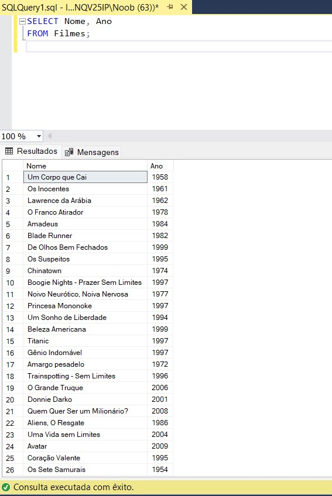

### 2 - Buscar o nome e ano dos filmes, ordenados por ordem crescente pelo ano
```sql
SELECT Nome, Ano FROM Filmes ORDER BY Ano
```
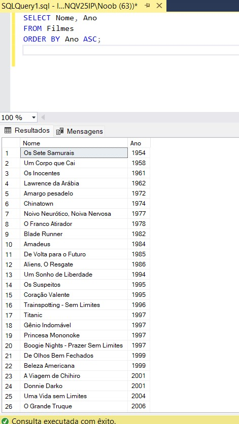

### 3 - Buscar pelo filme de volta para o futuro, trazendo o nome, ano e a duração
```sql
SELECT Nome, Ano, Duracao FROM Filmes WHERE Nome = 'De Volta para o Futuro'
```
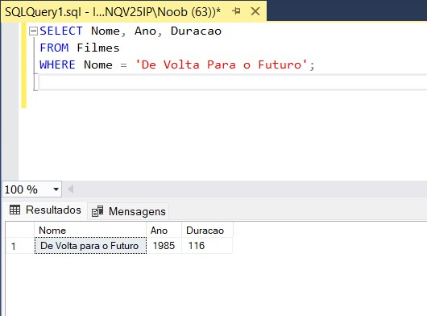

### 4 - Buscar os filmes lançados em 1997
```sql
SELECT Nome, Ano, Duracao FROM Filmes WHERE Ano = 1997
```
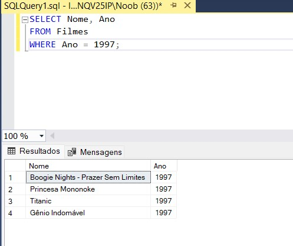

### 5 - Buscar os filmes lançados APÓS o ano 2000
```sql
SELECT Nome, Ano, Duracao FROM Filmes WHERE Ano > 2000
```
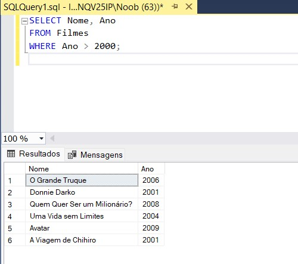

### 6 - Buscar os filmes com a duracao maior que 100 e menor que 150, ordenando pela duracao em ordem crescente
```sql
SELECT Nome, Ano, Duracao FROM Filmes WHERE Duracao > 100 AND Duracao < 150 ORDER BY Duracao
```
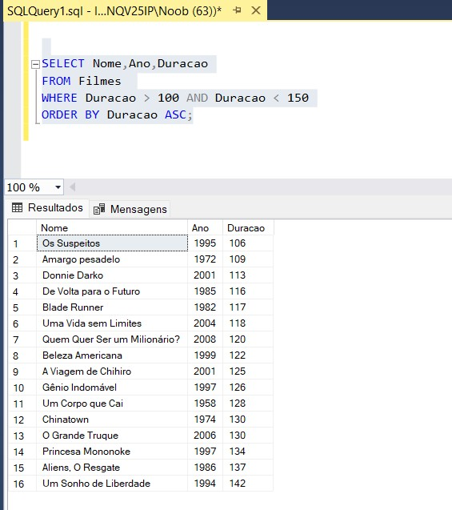

### 7 - Buscar a quantidade de filmes lançadas no ano, agrupando por ano, ordenando pela duracao em ordem decrescente
```sql
SELECT Ano, COUNT(*) as Quantidade FROM Filmes GROUP BY Ano ORDER BY Ano DESC
```
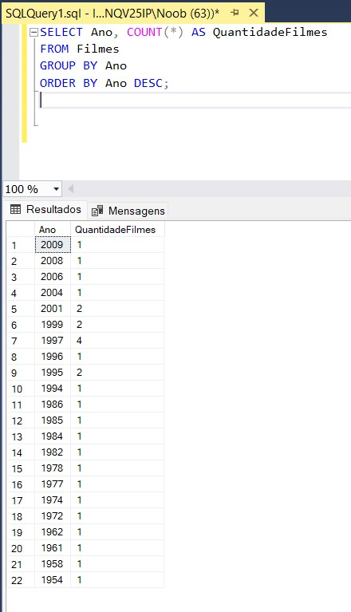

### 8 - Buscar os Atores do gênero masculino, retornando o PrimeiroNome, UltimoNome
```sql
SELECT PrimeiroNome, UltimoNome FROM Atores WHERE Genero = 'M'
```
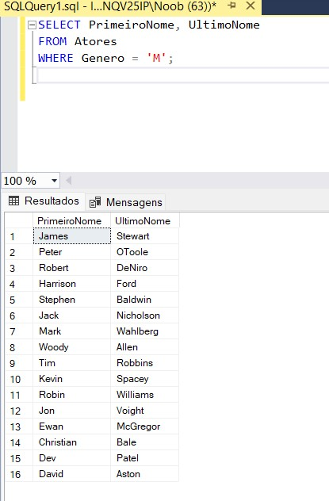

### 9 - Buscar os Atores do gênero feminino, retornando o PrimeiroNome, UltimoNome, e ordenando pelo PrimeiroNome
```sql
SELECT PrimeiroNome, UltimoNome FROM Atores WHERE Genero = 'F' ORDER BY PrimeiroNome
```
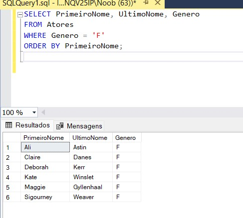

### 10 - Buscar o nome do filme e o gênero
```sql
SELECT f.Nome, g.Nome as Genero 
FROM Filmes f
INNER JOIN FilmesGenero fg ON f.Id = fg.IdFilme
INNER JOIN Generos g ON fg.IdGenero = g.Id
```
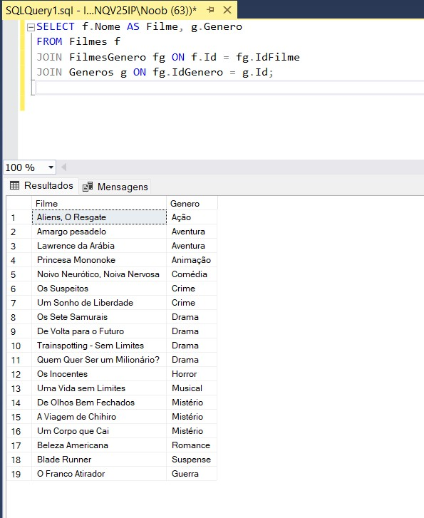

### 11 - Buscar o nome do filme e o gênero do tipo "Mistério"
```sql
SELECT f.Nome, g.Nome as Genero 
FROM Filmes f
INNER JOIN FilmesGenero fg ON f.Id = fg.IdFilme
INNER JOIN Generos g ON fg.IdGenero = g.Id
WHERE g.Nome = 'Mistério'
```
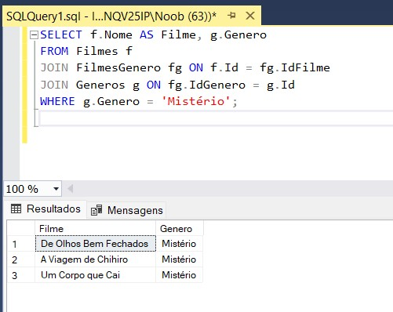

### 12 - Buscar o nome do filme e os atores, trazendo o PrimeiroNome, UltimoNome e seu Papel
```sql
SELECT f.Nome, a.PrimeiroNome, a.UltimoNome, ef.Papel
FROM Filmes f
INNER JOIN ElencoFilme ef ON f.Id = ef.IdFilme
INNER JOIN Atores a ON ef.IdAtor = a.Id
```
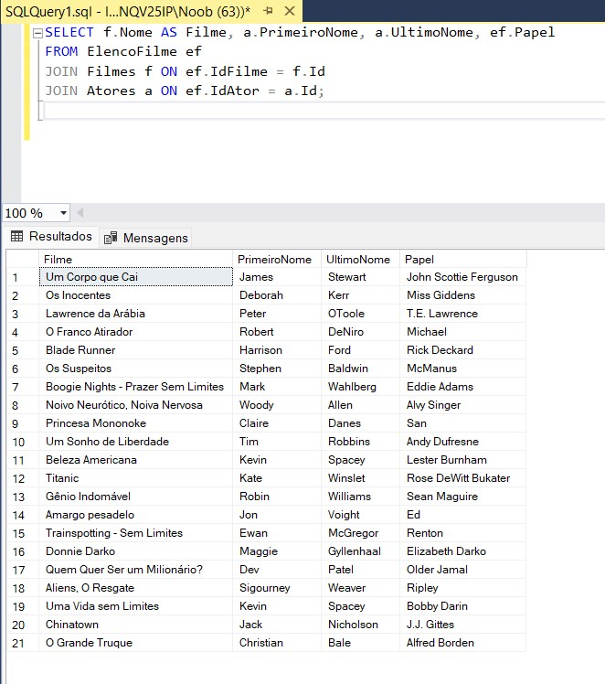

## 🤝 Contribuindo

Sinta-se à vontade para contribuir com este projeto:

1. Faça um Fork
2. Crie uma Branch para sua Feature (`git checkout -b feature/NovaFeature`)
3. Commit suas mudanças (`git commit -m 'Adicionando nova feature'`)
4. Push para a Branch (`git push origin feature/NovaFeature`)
5. Abra um Pull Request

## 📝 Licença

Este projeto está sob a licença Dio.

## 🔗 Links Úteis

- [Digital Innovation One](https://www.dio.me)
- [Documentação SQL Server](https://docs.microsoft.com/sql)
- [Curso .NET](https://www.dio.me/curso-net)

---
⌨️ com ❤️ por [Seu Nome](https://github.com/claudiofaraleski) 😊